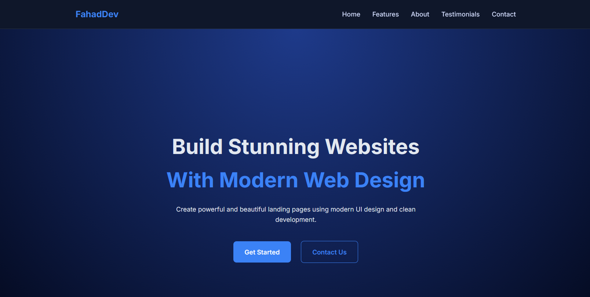

# 🌐 Landing Page

A modern and responsive **Landing Page** designed to showcase a product, service, or personal portfolio. The page features a clean layout, engaging sections, and a user-friendly interface. This project is built using **HTML, CSS, and JavaScript** and demonstrates core front-end development and UI design skills.

---

🔗 **Live Demo:** https://DevByFahad.github.io/Landing-Page/

---

## 📌 Features

* 🎨 Modern and clean UI design
* 📱 Fully responsive layout
* ⚡ Smooth scrolling navigation
* 🧭 Structured sections (Hero, About, Services, Contact)
* 🚀 Fast and lightweight
* 🎯 Built with vanilla JavaScript

---

## 🛠 Technologies Used

* HTML
* CSS
* JavaScript

---

## 🚀 How to Run the Project

1. Clone the repository

```
git clone https://github.com/DevByFahad/landing-page.git
```

2. Navigate to the project folder

```
cd landing-page
```

3. Open the `index.html` file in your browser.

---

## 📂 Project Structure

```
landing-page
│
├── index.html
├── style.css
├── script.js
└── README.md
```

---

## 🎯 Purpose of the Project

This project was created to practice and demonstrate fundamental web development concepts such as:

* Building responsive layouts
* Creating modern landing page designs
* Structuring web page sections
* Improving front-end UI skills

---

## 👨‍💻 Author

**Muhammad Fahad**

---

## ⭐ Show Your Support

If you like this project, consider giving it a **star** on GitHub!

---

## 📸 Landing Page

Here’s what it looks like 👇


